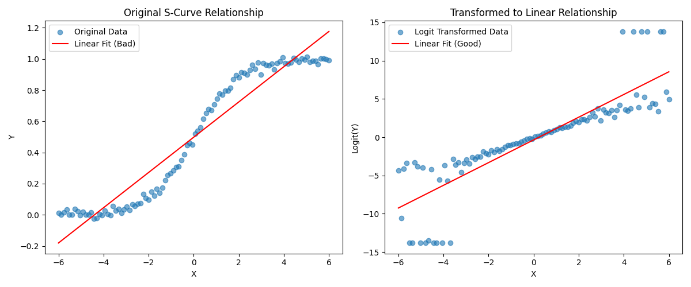

# auto-feat
automatic feature engineering

# System Architecture: Feature Pattern Analysis and Transformation

## 1. Project Strucutre
```
src/
├── main.py               # Main class and orchestration
├── detectors/           # Pattern detection modules
│   ├── __init__.py
│   ├── base.py         # Base detector class
│   ├── linear_detector.py       # Linear pattern detector
│   ├── exponential_detector.py  # Exponential pattern detector
│   ├── s_curve_detector.py      # S-curve pattern detector
│   └── decay_detector.py       # Decay pattern detector
├── transformers/       # Data transformation modules
│   ├── __init__.py
│   ├── base.py        # Base transformer class
│   ├── log.py         # Log transformer
│   ├── logit.py       # Logit transformer/ s_curve
│   └── boxcox.py      # BoxCox transformer
└── visualization/     # Visualization modules
    ├── __init__.py
    └── pattern_visualizer.py      # Plotting utilities
```

## 2. Core Components

```python
# detectors/base.py
class BasePatternDetector(ABC):
    """
    Base class for all pattern detectors.
    This should fit the current pattern on the given variables and return the parameters and respective score.
    """
    
    def __init__(self):
        self.params = {}
        self.fit_score = 0.0
        
    @abstractmethod
    def detect(self, x, y):
        """Detect if the pattern exists in the data."""
        pass
    
    @abstractmethod
    def get_parameters(self):
        """Return the parameters of the fitted pattern."""
        pass
    
    def get_fit_score(self):
        """Return the goodness of fit score."""
        return self.fit_score

# transformers/base.py
class BaseTransformer(ABC):
    """Base class for all feature transformers."""
    
    @abstractmethod
    def fit(self, X):
        """Fit the transformer to the data."""
        pass
    
    @abstractmethod
    def transform(self, X):
        """Transform the input feature."""
        pass
    
    def fit_transform(self, X):
        """Fit the transformer and transform the data."""
        return self.fit(X).transform(X)

```

## 3. Before and After Transformation:
### S Curve:


### Other Patterns

